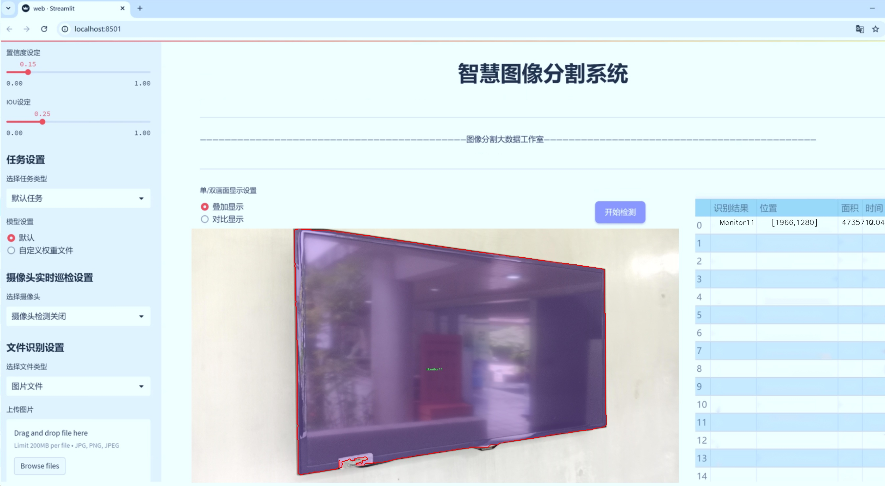
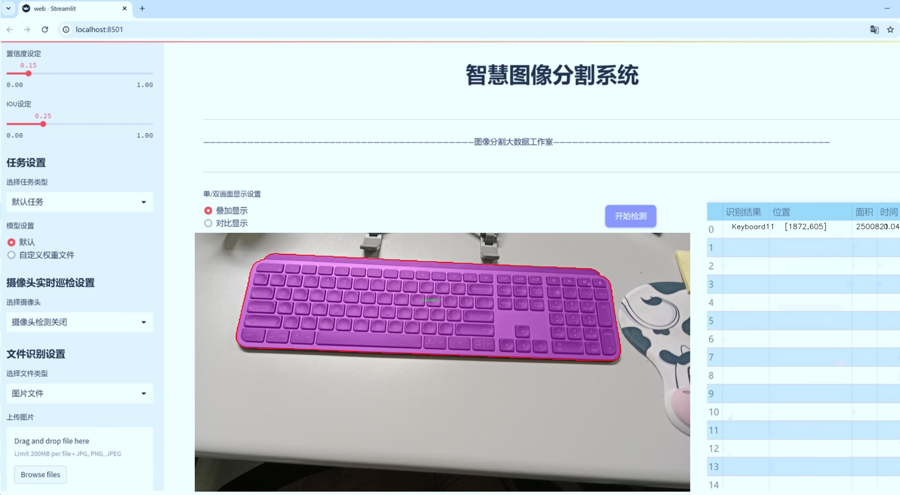
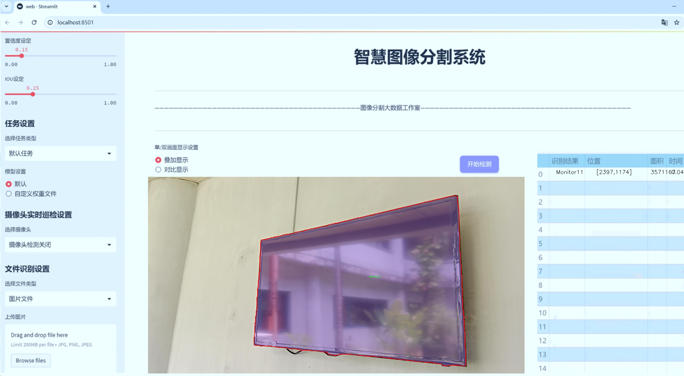
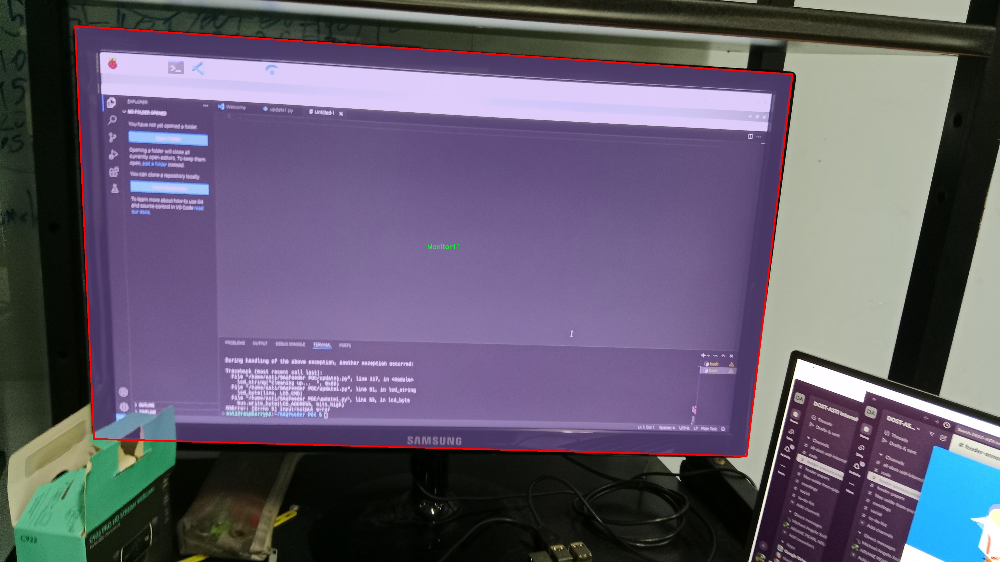
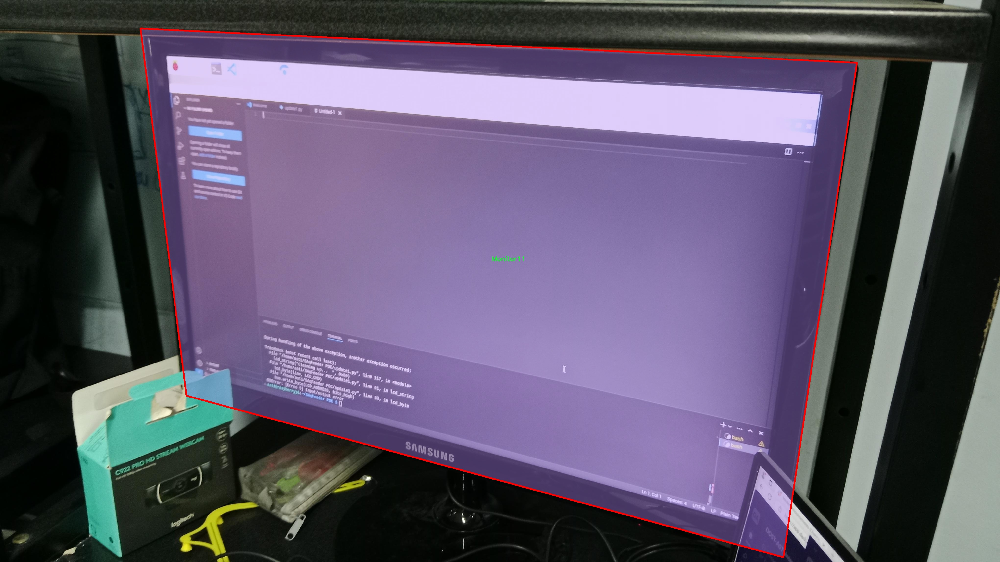
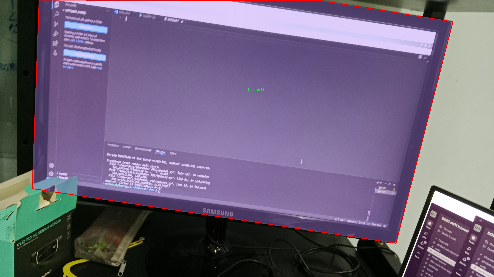
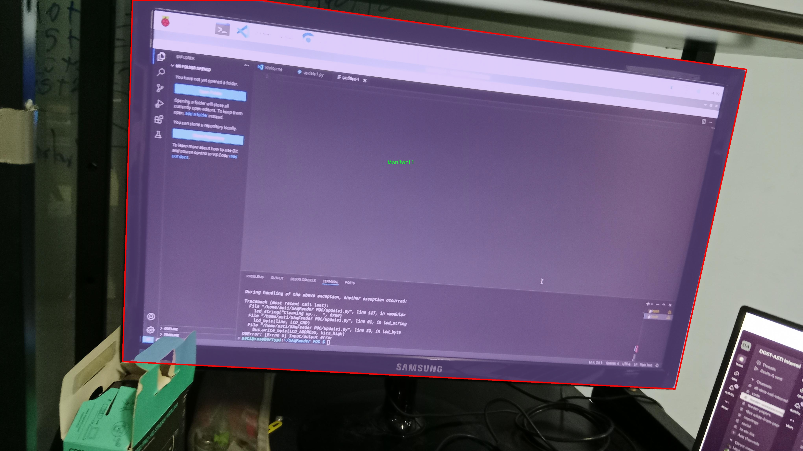
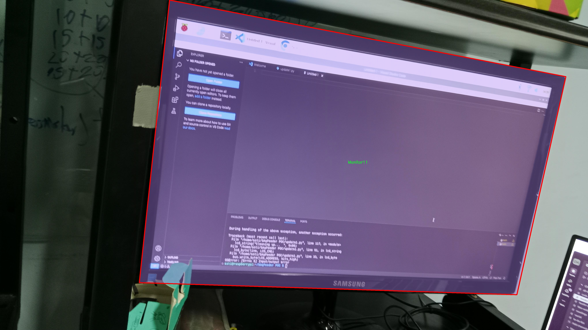

# 办公设备图像分割系统源码＆数据集分享
 [yolov8-seg-SPDConv＆yolov8-seg-C2f-DySnakeConv等50+全套改进创新点发刊_一键训练教程_Web前端展示]

### 1.研究背景与意义

项目参考[ILSVRC ImageNet Large Scale Visual Recognition Challenge](https://gitee.com/YOLOv8_YOLOv11_Segmentation_Studio/projects)

项目来源[AAAI Global Al lnnovation Contest](https://kdocs.cn/l/cszuIiCKVNis)

研究背景与意义

随着信息技术的迅猛发展，办公环境中各种设备的普及和多样化，使得办公设备的管理和维护变得愈加复杂。办公设备的种类繁多，包括键盘、笔记本电脑、显示器、鼠标、鼠标垫和触控板等，这些设备在日常使用中不可避免地会产生磨损、故障和老化等问题。因此，如何高效、准确地对这些设备进行监测和管理，成为了现代办公管理中亟待解决的课题。传统的人工检查方式不仅耗时耗力，而且容易出现漏检和误检的情况，难以满足高效办公的需求。基于此，图像分割技术的应用应运而生，尤其是深度学习领域的进步，使得图像分割的精度和效率得到了显著提升。

YOLO（You Only Look Once）系列模型作为一种实时目标检测算法，因其高效性和准确性在图像处理领域得到了广泛应用。YOLOv8作为该系列的最新版本，结合了更先进的网络结构和优化算法，具备了更强的特征提取能力和更快的推理速度。然而，尽管YOLOv8在目标检测方面表现出色，但在办公设备的图像分割任务中，仍然存在一定的局限性。为了更好地适应办公设备的特征，提升图像分割的准确性和实用性，基于改进YOLOv8的办公设备图像分割系统的研究显得尤为重要。

本研究所使用的数据集包含1200张图像，涵盖了六类办公设备，包括键盘、笔记本电脑、显示器、鼠标、鼠标垫和触控板。这些数据不仅数量充足，而且类别多样，为模型的训练和测试提供了良好的基础。通过对这些图像进行实例分割，可以实现对每一类设备的精确定位和识别，从而为后续的设备管理和维护提供数据支持。此外，针对不同设备的特征，改进YOLOv8模型的结构和参数设置，可以有效提升模型在特定场景下的表现，进一步增强系统的实用性。

研究的意义不仅在于提升办公设备的管理效率，更在于推动图像分割技术在实际应用中的落地。通过对办公设备的精准识别和分割，可以为企业提供更为智能化的管理方案，降低人工成本，提高工作效率。同时，本研究也为其他领域的图像分割任务提供了借鉴，推动了深度学习技术在更多场景中的应用。此外，基于改进YOLOv8的办公设备图像分割系统的研究，将为后续的相关研究提供基础数据和模型参考，促进学术界和工业界的进一步合作与发展。

综上所述，基于改进YOLOv8的办公设备图像分割系统的研究，不仅具有重要的理论价值，更具备广泛的应用前景。通过本研究的开展，期望能够为办公设备的智能管理提供新的思路和方法，推动办公环境的数字化转型，为实现高效、智能的办公管理奠定基础。

### 2.图片演示







##### 注意：由于此博客编辑较早，上面“2.图片演示”和“3.视频演示”展示的系统图片或者视频可能为老版本，新版本在老版本的基础上升级如下：（实际效果以升级的新版本为准）

  （1）适配了YOLOV8的“目标检测”模型和“实例分割”模型，通过加载相应的权重（.pt）文件即可自适应加载模型。

  （2）支持“图片识别”、“视频识别”、“摄像头实时识别”三种识别模式。

  （3）支持“图片识别”、“视频识别”、“摄像头实时识别”三种识别结果保存导出，解决手动导出（容易卡顿出现爆内存）存在的问题，识别完自动保存结果并导出到tempDir中。

  （4）支持Web前端系统中的标题、背景图等自定义修改，后面提供修改教程。

  另外本项目提供训练的数据集和训练教程,暂不提供权重文件（best.pt）,需要您按照教程进行训练后实现图片演示和Web前端界面演示的效果。

### 3.视频演示

[3.1 视频演示](https://www.bilibili.com/video/BV1wyyVY4Ecs/)

### 4.数据集信息展示

##### 4.1 本项目数据集详细数据（类别数＆类别名）

nc: 6
names: ['Keyboard11', 'Laptop11', 'Monitor11', 'Mouse11', 'Mousepad11', 'Touchpad11']


##### 4.2 本项目数据集信息介绍

数据集信息展示

在本研究中，我们采用了名为“opagangnamstyles”的数据集，以支持对办公设备图像分割系统的训练，特别是针对改进YOLOv8-seg模型的应用。该数据集专注于办公环境中常见设备的图像数据，涵盖了六个主要类别，具体包括：键盘（Keyboard11）、笔记本电脑（Laptop11）、显示器（Monitor11）、鼠标（Mouse11）、鼠标垫（Mousepad11）和触控板（Touchpad11）。这些类别的选择反映了现代办公环境中不可或缺的设备，能够为图像分割任务提供丰富的样本和多样化的特征。

“opagangnamstyles”数据集的构建旨在提供高质量的图像，以便于模型的训练和验证。每个类别的图像均经过精心挑选，确保其在不同的光照条件、角度和背景下均能展现出清晰的特征。这种多样性不仅有助于提高模型的鲁棒性，还能增强其在实际应用中的适应能力。例如，键盘和鼠标的图像可能会在不同的桌面环境中出现，具有不同的色彩和设计风格，这为模型提供了丰富的学习样本。

在数据集的标注过程中，我们采用了精确的分割标注技术，以确保每个类别的边界清晰可辨。这一过程不仅提高了数据集的质量，也为后续的模型训练提供了坚实的基础。通过使用先进的标注工具，标注团队能够高效地处理大量图像，并确保每个设备的细节都被准确捕捉。这种高质量的标注对于训练深度学习模型至关重要，因为模型的性能在很大程度上依赖于输入数据的质量。

此外，数据集还考虑到了不同设备之间的相似性和差异性。例如，鼠标和触控板在功能上有相似之处，但在外观和使用场景上却有显著的不同。通过在数据集中引入这些细微的差别，模型能够学习到更为复杂的特征，从而在实际应用中更好地进行图像分割。这种细致的分类和标注不仅提升了模型的准确性，也为后续的应用场景提供了更为广泛的支持。

为了进一步增强模型的泛化能力，我们在数据集中引入了数据增强技术。这包括图像的旋转、缩放、裁剪和颜色调整等操作，使得模型能够在面对不同的输入时，依然保持良好的性能。这种策略不仅提高了模型的训练效率，也为其在真实世界中的应用奠定了基础。

总之，“opagangnamstyles”数据集为改进YOLOv8-seg的办公设备图像分割系统提供了丰富的资源和坚实的基础。通过精确的标注、多样化的样本和有效的数据增强策略，该数据集不仅有助于提升模型的性能，也为未来的研究和应用提供了广阔的前景。随着办公设备的不断发展和变化，持续更新和扩展该数据集将是未来研究的重要方向，以确保模型始终能够适应新的挑战和需求。











### 5.全套项目环境部署视频教程（零基础手把手教学）

[5.1 环境部署教程链接（零基础手把手教学）](https://www.bilibili.com/video/BV1jG4Ve4E9t/?vd_source=bc9aec86d164b67a7004b996143742dc)


[5.2 安装Python虚拟环境创建和依赖库安装视频教程链接（零基础手把手教学）](https://www.bilibili.com/video/BV1nA4VeYEze/?vd_source=bc9aec86d164b67a7004b996143742dc)

### 6.手把手YOLOV8-seg训练视频教程（零基础小白有手就能学会）

[6.1 手把手YOLOV8-seg训练视频教程（零基础小白有手就能学会）](https://www.bilibili.com/video/BV1cA4VeYETe/?vd_source=bc9aec86d164b67a7004b996143742dc)


按照上面的训练视频教程链接加载项目提供的数据集，运行train.py即可开始训练



     Epoch   gpu_mem       box       obj       cls    labels  img_size
     1/200     0G   0.01576   0.01955  0.007536        22      1280: 100%|██████████| 849/849 [14:42<00:00,  1.04s/it]
               Class     Images     Labels          P          R     mAP@.5 mAP@.5:.95: 100%|██████████| 213/213 [01:14<00:00,  2.87it/s]
                 all       3395      17314      0.994      0.957      0.0957      0.0843

     Epoch   gpu_mem       box       obj       cls    labels  img_size
     2/200     0G   0.01578   0.01923  0.007006        22      1280: 100%|██████████| 849/849 [14:44<00:00,  1.04s/it]
               Class     Images     Labels          P          R     mAP@.5 mAP@.5:.95: 100%|██████████| 213/213 [01:12<00:00,  2.95it/s]
                 all       3395      17314      0.996      0.956      0.0957      0.0845

     Epoch   gpu_mem       box       obj       cls    labels  img_size
     3/200     0G   0.01561    0.0191  0.006895        27      1280: 100%|██████████| 849/849 [10:56<00:00,  1.29it/s]
               Class     Images     Labels          P          R     mAP@.5 mAP@.5:.95: 100%|███████   | 187/213 [00:52<00:00,  4.04it/s]
                 all       3395      17314      0.996      0.957      0.0957      0.0845


### 7.50+种全套YOLOV8-seg创新点代码加载调参视频教程（一键加载写好的改进模型的配置文件）

[7.1 50+种全套YOLOV8-seg创新点代码加载调参视频教程（一键加载写好的改进模型的配置文件）](https://www.bilibili.com/video/BV1Hw4VePEXv/?vd_source=bc9aec86d164b67a7004b996143742dc)

### 8.YOLOV8-seg图像分割算法原理

原始YOLOv8-seg算法原理

YOLOv8-seg算法是YOLO系列中的最新版本，专注于目标检测与分割任务，结合了YOLOv8的高效特性与图像分割的精细化需求。该算法的设计理念是实现实时、高效且准确的目标检测与分割，特别适用于复杂场景中的物体识别与定位。YOLOv8-seg的架构主要由输入层、骨干网络、特征融合层和检测头组成，每个部分都经过精心设计，以提升整体性能。

在输入层，YOLOv8-seg采用了先进的数据增强技术，包括马赛克数据增强和自适应锚框计算。这些技术不仅提高了模型的鲁棒性，还有效扩展了训练数据的多样性，从而使模型能够更好地适应不同的场景和物体。自适应锚框计算的引入，使得模型能够根据输入图像的特征动态调整锚框的大小和比例，进一步提升了检测的准确性。

骨干网络部分，YOLOv8-seg使用了CSPDarknet结构，这是一种基于残差学习的网络架构。与前代模型相比，YOLOv8-seg引入了C2f模块，替代了传统的C3模块。C2f模块通过将输入特征图分为多个分支并进行卷积处理，能够有效增强梯度流，提升特征表示能力。这种结构的优势在于，它能够更好地捕捉到不同层次的特征信息，从而为后续的目标检测和分割提供更为丰富的特征支持。

特征融合层是YOLOv8-seg的关键组成部分，采用了特征金字塔网络（FPN）与路径聚合网络（PAN）的结合。这一设计使得模型能够在不同尺度上有效地融合特征，确保在处理小物体时不丢失重要信息。通过引入BiFPN网络，YOLOv8-seg实现了高效的双向跨尺度连接与加权特征融合，显著提高了模型对多尺度特征的提取速度与准确性。这种特征融合策略，使得模型在处理复杂场景时，能够更好地识别和分割出目标物体。

在检测头部分，YOLOv8-seg采用了解耦头结构，替代了传统的耦合头。这一结构的优势在于，它将分类与回归任务分开处理，使得模型在目标检测与分割时能够更加灵活和高效。具体而言，分类分支使用了二元交叉熵损失（BCELoss），而回归分支则结合了分布焦点损失（DFLoss）和完全交并比损失（CIOULoss），以提升边界框预测的精准性。通过这种解耦设计，YOLOv8-seg能够在目标检测的同时，实现对物体边界的精确分割。

YOLOv8-seg还引入了无锚框（Anchor-Free）检测方式，直接预测目标的中心点和宽高比例。这一创新的检测方式，减少了对锚框的依赖，从而加速了非最大抑制（NMS）过程，提高了检测速度与准确度。这种无锚框的设计，尤其适用于复杂背景下的目标检测与分割任务，使得模型在实际应用中表现出色。

此外，YOLOv8-seg在模型的轻量化方面也做了大量的工作。通过对网络结构的优化与精简，YOLOv8-seg能够在保持高性能的同时，显著降低模型的参数量与计算量。这一特性使得YOLOv8-seg能够在资源受限的设备上运行，满足实时检测与分割的需求。

总的来说，YOLOv8-seg算法通过创新的网络结构设计、有效的特征融合策略以及灵活的检测方式，成功地将目标检测与分割任务结合在一起。其在准确性、速度和模型轻量化方面的优越表现，使得YOLOv8-seg成为了当前目标检测与分割领域中的一项重要进展。随着YOLOv8-seg的不断发展与应用，未来在智能监控、自动驾驶、医学影像等多个领域都将展现出广阔的应用前景。


### 9.系统功能展示（检测对象为举例，实际内容以本项目数据集为准）

图9.1.系统支持检测结果表格显示

  图9.2.系统支持置信度和IOU阈值手动调节

  图9.3.系统支持自定义加载权重文件best.pt(需要你通过步骤5中训练获得)

  图9.4.系统支持摄像头实时识别

  图9.5.系统支持图片识别

  图9.6.系统支持视频识别

  图9.7.系统支持识别结果文件自动保存

  图9.8.系统支持Excel导出检测结果数据


### 10.50+种全套YOLOV8-seg创新点原理讲解（非科班也可以轻松写刊发刊，V11版本正在科研待更新）

#### 10.1 由于篇幅限制，每个创新点的具体原理讲解就不一一展开，具体见下列网址中的创新点对应子项目的技术原理博客网址【Blog】：


[10.1 50+种全套YOLOV8-seg创新点原理讲解链接](https://gitee.com/qunmasj/good)

#### 10.2 部分改进模块原理讲解(完整的改进原理见上图和技术博客链接)【如果此小节的图加载失败可以通过CSDN或者Github搜索该博客的标题访问原始博客，原始博客图片显示正常】
### YOLOv8算法原理
YOLOv8算法由Glenn-Jocher 提出，是跟YOLOv3算法、YOLOv5算法一脉相承的，主要的改进点如下:
(1)数据预处理。YOLOv8的数据预处理依旧采用YOLOv5的策略,在训练时，主要采用包括马赛克增强(Mosaic)、混合增强(Mixup)、空间扰动(randomperspective)以及颜色扰动(HSV augment)四个增强手段。
(2)骨干网络结构。YOLOv8的骨干网络结构可从YOLOv5略见一斑，YOLOv5的主干网络的架构规律十分清晰，总体来看就是每用一层步长为2的3×3卷积去降采样特征图，接一个C3模块来进一步强化其中的特征，且C3的基本深度参数分别为“3/6/9/3”，其会根据不同规模的模型的来做相应的缩放。在的YOLOv8中，大体上也还是继承了这一特点，原先的C3模块均被替换成了新的C2f模块，C2f 模块加入更多的分支，丰富梯度回传时的支流。下面展示了YOLOv8的C2f模块和YOLOv5的C3模块，其网络结构图所示。


(3)FPN-PAN结构。YOLOv8仍采用FPN+PAN结构来构建YOLO的特征金字塔，使多尺度信息之间进行充分的融合。除了FPN-PAN里面的C3模块被替换为C2f模块外，其余部分与YOLOv5的FPN-PAN结构基本一致。
(4)Detection head结构。从 YOLOv3到 YOLOv5，其检测头一直都是“耦合”(Coupled)的,即使用一层卷积同时完成分类和定位两个任务，直到YOLOX的问世， YOLO系列才第一次换装“解耦头”(Decoupled Head)。YOLOv8也同样也采用了解耦头的结构，两条并行的分支分别取提取类别特征和位置特征，然后各用一层1x1卷积完成分类和定位任务。YOLOv8整体的网络结构由图所示。


(5)标签分配策略。尽管YOLOv5设计了自动聚类候选框的一些功能，但是聚类候选框是依赖于数据集的。若数据集不够充分，无法较为准确地反映数据本身的分布特征，聚类出来的候选框也会与真实物体尺寸比例悬殊过大。YOLOv8没有采用候选框策略，所以解决的问题就是正负样本匹配的多尺度分配。不同于YOLOX所使用的 SimOTA，YOLOv8在标签分配问题上采用了和YOLOv6相同的TOOD策略，是一种动态标签分配策略。YOLOv8只用到了targetboze。和target scores，未含是否有物体预测，故 YOLOv8的损失就主要包括两大部分∶类别损失和位置损失。对于YOLOv8，其分类损失为VFLLoss(Varifocal Loss)，其回归损失为CIoU Loss 与 DFL Loss 的形式。
其中 Varifocal Loss定义如下:


其中p为预测的类别得分，p ∈ [0.1]。q为预测的目标分数(若为真实类别，则q为预测和真值的 loU;若为其他类别。q为0 )。VFL Loss使用不对称参数来对正负样本进行加权，通过只对负样本进行衰减，达到不对等的处理前景和背景对损失的贡献。对正样本，使用q进行了加权，如果正样本的GTiou很高时,则对损失的贡献更大一些，可以让网络聚焦于那些高质量的样本上，即训练高质量的正例对AP的提升比低质量的更大一些。对负样本，使用p进行了降权，降低了负例对损失的贡献，因负样本的预测p在取次幂后会变得更小，这样就能够降低负样本对损失的整体贡献。

### 动态蛇形卷积Dynamic Snake Convolution

参考论文： 2307.08388.pdf (arxiv.org)

血管、道路等拓扑管状结构的精确分割在各个领域都至关重要，确保下游任务的准确性和效率。 然而，许多因素使任务变得复杂，包括薄的局部结构和可变的全局形态。在这项工作中，我们注意到管状结构的特殊性，并利用这些知识来指导我们的 DSCNet 在三个阶段同时增强感知：特征提取、特征融合、 和损失约束。 首先，我们提出了一种动态蛇卷积，通过自适应地关注细长和曲折的局部结构来准确捕获管状结构的特征。 随后，我们提出了一种多视图特征融合策略，以补充特征融合过程中多角度对特征的关注，确保保留来自不同全局形态的重要信息。 最后，提出了一种基于持久同源性的连续性约束损失函数，以更好地约束分割的拓扑连续性。 2D 和 3D 数据集上的实验表明，与多种方法相比，我们的 DSCNet 在管状结构分割任务上提供了更好的准确性和连续性。 我们的代码是公开的。 
主要的挑战源于细长微弱的局部结构特征与复杂多变的全局形态特征。本文关注到管状结构细长连续的特点，并利用这一信息在神经网络以下三个阶段同时增强感知：特征提取、特征融合和损失约束。分别设计了动态蛇形卷积（Dynamic Snake Convolution），多视角特征融合策略与连续性拓扑约束损失。 

我们希望卷积核一方面能够自由地贴合结构学习特征，另一方面能够在约束条件下不偏离目标结构太远。在观察管状结构的细长连续的特征后，脑海里想到了一个动物——蛇。我们希望卷积核能够像蛇一样动态地扭动，来贴合目标的结构。

我们希望卷积核一方面能够自由地贴合结构学习特征，另一方面能够在约束条件下不偏离目标结构太远。在观察管状结构的细长连续的特征后，脑海里想到了一个动物——蛇。我们希望卷积核能够像蛇一样动态地扭动，来贴合目标的结构。


### DCNV2融入YOLOv8
DCN和DCNv2（可变性卷积）
网上关于两篇文章的详细描述已经很多了，我这里具体的细节就不多讲了，只说一下其中实现起来比较困惑的点。（黑体字会讲解）

DCNv1解决的问题就是我们常规的图像增强，仿射变换（线性变换加平移）不能解决的多种形式目标变换的几何变换的问题。如下图所示。

可变性卷积的思想很简单，就是讲原来固定形状的卷积核变成可变的。如下图所示：


首先来看普通卷积，以3x3卷积为例对于每个输出y(p0)，都要从x上采样9个位置，这9个位置都在中心位置x(p0)向四周扩散得到的gird形状上，(-1,-1)代表x(p0)的左上角，(1,1)代表x(p0)的右下角，其他类似。

用公式表示如下：


可变性卷积Deformable Conv操作并没有改变卷积的计算操作，而是在卷积操作的作用区域上，加入了一个可学习的参数∆pn。同样对于每个输出y(p0)，都要从x上采样9个位置，这9个位置是中心位置x(p0)向四周扩散得到的，但是多了 ∆pn，允许采样点扩散成非gird形状。


偏移量是通过对原始特征层进行卷积得到的。比如输入特征层是w×h×c，先对输入的特征层进行卷积操作，得到w×h×2c的offset field。这里的w和h和原始特征层的w和h是一致的，offset field里面的值是输入特征层对应位置的偏移量，偏移量有x和y两个方向，所以offset field的channel数是2c。offset field里的偏移量是卷积得到的，可能是浮点数，所以接下来需要通过双向性插值计算偏移位置的特征值。在偏移量的学习中，梯度是通过双线性插值来进行反向传播的。
看到这里是不是还是有点迷茫呢？那到底程序上面怎么实现呢？


事实上由上面的公式我们可以看得出来∆pn这个偏移量是加在原像素点上的，但是我们怎么样从代码上对原像素点加这个量呢？其实很简单，就是用一个普通的卷积核去跟输入图片（一般是输入的feature_map）卷积就可以了卷积核的数量是2N也就是23*3==18（前9个通道是x方向的偏移量，后9个是y方向的偏移量），然后把这个卷积的结果与正常卷积的结果进行相加就可以了。
然后又有了第二个问题，怎么样反向传播呢？为什么会有这个问题呢？因为求出来的偏移量+正常卷积输出的结果往往是一个浮点数，浮点数是无法对应到原图的像素点的，所以自然就想到了双线性差值的方法求出浮点数对应的浮点像素点。


#### DCN v2
对于positive的样本来说，采样的特征应该focus在RoI内，如果特征中包含了过多超出RoI的内容，那么结果会受到影响和干扰。而negative样本则恰恰相反，引入一些超出RoI的特征有助于帮助网络判别这个区域是背景区域。

DCNv1引入了可变形卷积，能更好的适应目标的几何变换。但是v1可视化结果显示其感受野对应位置超出了目标范围，导致特征不受图像内容影响（理想情况是所有的对应位置分布在目标范围以内）。

为了解决该问题：提出v2, 主要有

1、扩展可变形卷积，增强建模能力
2、提出了特征模拟方案指导网络培训：feature mimicking scheme

上面这段话是什么意思呢，通俗来讲就是，我们的可变性卷积的区域大于目标所在区域，所以这时候就会对非目标区域进行错误识别。

所以自然能想到的解决方案就是加入权重项进行惩罚。（至于这个实现起来就比较简单了，直接初始化一个权重然后乘(input+offsets)就可以了）


可调节的RoIpooling也是类似的，公式如下：


### 11.项目核心源码讲解（再也不用担心看不懂代码逻辑）

#### 11.1 ui.py

以下是经过简化和注释的核心代码部分：

```python
import sys
import subprocess
from QtFusion.path import abs_path

def run_script(script_path):
    """
    使用当前 Python 环境运行指定的脚本。

    Args:
        script_path (str): 要运行的脚本路径
    """
    # 获取当前 Python 解释器的路径
    python_path = sys.executable

    # 构建运行命令，使用 streamlit 运行指定的脚本
    command = f'"{python_path}" -m streamlit run "{script_path}"'

    # 执行命令，并等待其完成
    result = subprocess.run(command, shell=True)
    
    # 检查命令执行结果，如果返回码不为0，则表示出错
    if result.returncode != 0:
        print("脚本运行出错。")

# 主程序入口
if __name__ == "__main__":
    # 获取脚本的绝对路径
    script_path = abs_path("web.py")

    # 运行指定的脚本
    run_script(script_path)
```

### 代码分析与注释：

1. **导入模块**：
   - `sys`：用于访问与 Python 解释器相关的变量和函数。
   - `subprocess`：用于创建新进程、连接到它们的输入/输出/错误管道，并获取返回码。
   - `abs_path`：从 `QtFusion.path` 导入的函数，用于获取文件的绝对路径。

2. **`run_script` 函数**：
   - **参数**：接收一个字符串类型的参数 `script_path`，表示要运行的 Python 脚本的路径。
   - **功能**：构建并执行一个命令，使用当前 Python 环境运行指定的脚本。
   - **命令构建**：使用 `sys.executable` 获取当前 Python 解释器的路径，并构建运行 `streamlit` 的命令。
   - **执行命令**：使用 `subprocess.run` 执行命令，并等待其完成。
   - **错误处理**：检查返回码，如果不为0，则打印错误信息。

3. **主程序入口**：
   - 使用 `if __name__ == "__main__":` 确保只有在直接运行该脚本时才会执行以下代码。
   - 获取脚本 `web.py` 的绝对路径，并调用 `run_script` 函数运行该脚本。 

通过这些核心部分和注释，可以清晰地理解代码的功能和逻辑。

这个程序文件 `ui.py` 的主要功能是运行一个指定的 Python 脚本，具体来说是通过 Streamlit 框架来启动一个 Web 应用。程序的结构相对简单，主要包含了几个重要的部分。

首先，文件开头导入了一些必要的模块，包括 `sys`、`os` 和 `subprocess`。`sys` 模块用于访问与 Python 解释器紧密相关的变量和函数，`os` 模块提供了与操作系统交互的功能，而 `subprocess` 模块则用于创建新进程、连接到它们的输入/输出/错误管道，并获取它们的返回码。

接下来，程序定义了一个名为 `run_script` 的函数，该函数接受一个参数 `script_path`，表示要运行的脚本的路径。在函数内部，首先获取当前 Python 解释器的路径，这通过 `sys.executable` 实现。然后，构建一个命令字符串，使用当前的 Python 解释器和 Streamlit 模块来运行指定的脚本。命令的格式是 `"{python_path}" -m streamlit run "{script_path}"`，其中 `{python_path}` 和 `{script_path}` 会被实际的路径替换。

使用 `subprocess.run` 方法执行构建好的命令，`shell=True` 参数表示在 shell 中执行该命令。执行后，程序检查返回码，如果返回码不为 0，说明脚本运行出错，程序会打印出“脚本运行出错。”的提示信息。

最后，在 `if __name__ == "__main__":` 语句块中，程序指定了要运行的脚本路径，这里使用了 `abs_path("web.py")` 来获取 `web.py` 文件的绝对路径。然后调用 `run_script` 函数来运行这个脚本。

总的来说，这个文件的功能是为一个 Streamlit 应用提供一个启动入口，通过命令行运行指定的 Python 脚本，并处理可能出现的错误。

#### 11.2 ultralytics\nn\extra_modules\__init__.py

以下是保留的核心部分，并对代码进行了详细的中文注释：

```python
# 导入所需的模块和类
from .afpn import *  # 导入自适应特征金字塔网络（AFPN）相关的功能
from .attention import *  # 导入注意力机制相关的功能
from .block import *  # 导入网络中的基本模块或层
from .head import *  # 导入网络的头部结构，通常用于最终的分类或回归任务
from .rep_block import *  # 导入重复块的定义，可能用于构建深层网络
from .kernel_warehouse import *  # 导入与卷积核相关的功能，可能用于动态卷积
from .dynamic_snake_conv import *  # 导入动态蛇形卷积的实现
from .orepa import *  # 导入OREPA（可能是某种特定的网络结构或模块）
from .RFAConv import *  # 导入RFA卷积（可能是某种特定的卷积操作）

# 以上代码片段的主要功能是从当前包中导入多个模块，这些模块可能是构建深度学习模型所需的不同组件。
# 这些组件包括特征提取、注意力机制、卷积操作等，通常用于构建复杂的神经网络架构。
```

这段代码的核心在于模块的导入，便于后续构建和训练深度学习模型。每个导入的模块可能包含特定的网络结构、层或功能，这些都是构建现代深度学习模型的重要组成部分。

这个程序文件是一个Python模块的初始化文件，位于`ultralytics/nn/extra_modules/`目录下。它的主要功能是导入该目录下的多个子模块，使得这些模块可以在其他地方被方便地使用。

文件中包含了多个导入语句，每一行都从当前目录（即`extra_modules`）中导入一个特定的模块。这些模块分别是`afpn`、`attention`、`block`、`head`、`rep_block`、`kernel_warehouse`、`dynamic_snake_conv`、`orepa`和`RFAConv`。通过这种方式，用户在导入`extra_modules`时，可以直接访问这些子模块中的功能，而不需要单独导入每一个模块。

这种结构在大型项目中非常常见，它有助于组织代码，使得模块之间的依赖关系更加清晰，同时也简化了用户的使用体验。用户只需导入`extra_modules`，就能访问到所有相关的功能模块，提高了代码的可维护性和可读性。

#### 11.3 ultralytics\nn\backbone\revcol.py

以下是经过简化和注释的核心代码部分：

```python
import torch
import torch.nn as nn

# 定义一个用于获取GPU状态的函数
def get_gpu_states(fwd_gpu_devices):
    fwd_gpu_states = []
    for device in fwd_gpu_devices:
        with torch.cuda.device(device):
            fwd_gpu_states.append(torch.cuda.get_rng_state())
    return fwd_gpu_states

# 定义一个用于设置GPU状态的函数
def set_device_states(fwd_cpu_state, devices, states) -> None:
    torch.set_rng_state(fwd_cpu_state)  # 设置CPU的随机数生成状态
    for device, state in zip(devices, states):
        with torch.cuda.device(device):
            torch.cuda.set_rng_state(state)  # 设置每个GPU的随机数生成状态

# 定义一个用于反向传播的自定义函数
class ReverseFunction(torch.autograd.Function):
    @staticmethod
    def forward(ctx, run_functions, alpha, *args):
        # 保存前向传播所需的参数和状态
        ctx.run_functions = run_functions
        ctx.alpha = alpha
        ctx.preserve_rng_state = True
        
        # 获取输入参数
        x, c0, c1, c2, c3 = args
        
        # 进行前向计算
        c0 = run_functions[0](x, c1) + c0 * alpha[0]
        c1 = run_functions[1](c0, c2) + c1 * alpha[1]
        c2 = run_functions[2](c1, c3) + c2 * alpha[2]
        c3 = run_functions[3](c2, None) + c3 * alpha[3]
        
        # 保存中间结果以便后向传播使用
        ctx.save_for_backward(x, c0, c1, c2, c3)
        return x, c0, c1, c2, c3

    @staticmethod
    def backward(ctx, *grad_outputs):
        # 获取保存的中间结果
        x, c0, c1, c2, c3 = ctx.saved_tensors
        run_functions = ctx.run_functions
        alpha = ctx.alpha
        
        # 反向传播计算梯度
        g3_up = grad_outputs[4]
        g3_left = g3_up * alpha[3]
        oup3 = run_functions[3](c2, None)
        torch.autograd.backward(oup3, g3_up, retain_graph=True)
        
        # 依次计算每一层的梯度
        # 省略中间的具体计算过程，保持逻辑清晰
        
        return None, None, gx_up, g0_left, g1_left, g2_left, g3_left

# 定义一个融合模块
class Fusion(nn.Module):
    def __init__(self, level, channels, first_col) -> None:
        super().__init__()
        self.level = level
        self.first_col = first_col
        # 定义下采样和上采样操作
        self.down = Conv(channels[level-1], channels[level], k=2, s=2, p=0, act=False) if level in [1, 2, 3] else nn.Identity()
        if not first_col:
            self.up = nn.Sequential(Conv(channels[level+1], channels[level]), nn.Upsample(scale_factor=2, mode='nearest')) if level in [0, 1, 2] else nn.Identity()            

    def forward(self, *args):
        c_down, c_up = args
        if self.first_col:
            return self.down(c_down)
        else:
            return self.up(c_up) + self.down(c_down)

# 定义子网络
class SubNet(nn.Module):
    def __init__(self, channels, layers, kernel, first_col, save_memory) -> None:
        super().__init__()
        self.save_memory = save_memory
        # 定义每一层的融合和卷积模块
        self.level0 = Level(0, channels, layers, kernel, first_col)
        self.level1 = Level(1, channels, layers, kernel, first_col)
        self.level2 = Level(2, channels, layers, kernel, first_col)
        self.level3 = Level(3, channels, layers, kernel, first_col)

    def forward(self, *args):
        if self.save_memory:
            return self._forward_reverse(*args)  # 使用反向传播
        else:
            return self._forward_nonreverse(*args)  # 使用常规前向传播

# 定义主网络
class RevCol(nn.Module):
    def __init__(self, kernel='C2f', channels=[32, 64, 96, 128], layers=[2, 3, 6, 3], num_subnet=5, save_memory=True) -> None:
        super().__init__()
        self.num_subnet = num_subnet
        self.channels = channels
        self.layers = layers
        self.stem = Conv(3, channels[0], k=4, s=4, p=0)  # 初始卷积层

        # 添加多个子网络
        for i in range(num_subnet):
            first_col = (i == 0)
            self.add_module(f'subnet{str(i)}', SubNet(channels, layers, kernel, first_col, save_memory=save_memory))

    def forward(self, x):
        c0, c1, c2, c3 = 0, 0, 0, 0
        x = self.stem(x)  # 通过初始卷积层
        for i in range(self.num_subnet):
            c0, c1, c2, c3 = getattr(self, f'subnet{str(i)}')(x, c0, c1, c2, c3)  # 依次通过每个子网络
        return [c0, c1, c2, c3]  # 返回每层的输出
```

### 代码说明：
1. **GPU状态管理**：通过`get_gpu_states`和`set_device_states`函数管理GPU的随机数生成状态，确保在不同设备间的状态一致性。
2. **反向传播自定义函数**：`ReverseFunction`类实现了自定义的前向和反向传播逻辑，允许在反向传播过程中进行特定的计算和状态管理。
3. **融合模块**：`Fusion`类实现了下采样和上采样的操作，结合输入特征进行处理。
4. **子网络**：`SubNet`类定义了一个包含多个层的网络结构，可以选择使用反向传播或常规前向传播。
5. **主网络**：`RevCol`类构建了整个网络结构，包含多个子网络的组合，通过输入数据进行处理并返回结果。

这个程序文件`revcol.py`是一个用于构建神经网络反向传播机制的模块，主要包含了反向传播中的一些特殊操作和结构，适用于深度学习中的模型训练。文件中使用了PyTorch库来实现这些功能。

首先，文件导入了必要的PyTorch模块和自定义的卷积、块等模块。然后定义了一些工具函数，例如`get_gpu_states`和`get_gpu_device`，用于获取当前GPU的状态和设备信息，这对于多GPU训练非常重要。

接下来，定义了一个名为`ReverseFunction`的类，它继承自`torch.autograd.Function`，用于实现自定义的前向和反向传播操作。在`forward`方法中，输入的参数经过一系列的计算和状态保存，输出了多个中间结果。这个过程涉及到多个层的计算，并使用了一个可调的缩放因子`alpha`来控制各层输出的权重。

在`backward`方法中，反向传播的计算被实现。通过保存的中间结果和状态，逐层计算梯度，并利用短路连接的方式来优化计算。这种反向传播的实现方式允许在计算图中更灵活地处理梯度流动，特别是在需要保留某些中间状态的情况下。

文件中还定义了多个类，如`Fusion`、`Level`和`SubNet`，这些类分别实现了不同层次的融合操作、层级结构和子网络结构。`Fusion`类负责将来自不同层的特征进行融合，`Level`类实现了具体的卷积操作，而`SubNet`类则将多个层组合在一起，形成一个完整的子网络。

`RevCol`类是整个模块的核心，负责初始化和管理多个子网络。它包含了一个卷积层作为输入处理的起始部分，并通过循环结构将输入数据传递给每个子网络，最终输出多个特征图。

在`forward`方法中，首先通过卷积层处理输入，然后依次调用每个子网络进行特征提取和融合，最终返回所有子网络的输出特征。这种设计使得模型能够灵活地处理输入数据，并在训练过程中通过反向传播优化各个参数。

总的来说，这个文件实现了一个复杂的神经网络结构，利用了反向传播的特殊机制和多层次的特征融合方法，适用于需要高效特征提取和处理的深度学习任务。

#### 11.4 ultralytics\utils\callbacks\mlflow.py

以下是代码中最核心的部分，并附上详细的中文注释：

```python
from ultralytics.utils import LOGGER, RUNS_DIR, SETTINGS, TESTS_RUNNING, colorstr

try:
    import os

    # 确保在非测试环境下运行，且MLflow集成已启用
    assert not TESTS_RUNNING or 'test_mlflow' in os.environ.get('PYTEST_CURRENT_TEST', '')  # 不记录pytest日志
    assert SETTINGS['mlflow'] is True  # 验证MLflow集成是否启用
    import mlflow

    assert hasattr(mlflow, '__version__')  # 验证mlflow包是否有效
    from pathlib import Path
    PREFIX = colorstr('MLflow: ')  # 设置日志前缀

except (ImportError, AssertionError):
    mlflow = None  # 如果导入失败或断言失败，则将mlflow设置为None


def on_pretrain_routine_end(trainer):
    """
    在预训练例程结束时记录训练参数到MLflow。

    该函数根据环境变量和训练器参数设置MLflow日志。它设置跟踪URI、实验名称和运行名称，
    然后启动MLflow运行（如果尚未激活）。最后记录训练器的参数。

    参数:
        trainer (ultralytics.engine.trainer.BaseTrainer): 包含要记录的参数和参数的训练对象。

    全局变量:
        mlflow: 用于记录的mlflow模块。

    环境变量:
        MLFLOW_TRACKING_URI: MLflow跟踪的URI。如果未设置，默认为'runs/mlflow'。
        MLFLOW_EXPERIMENT_NAME: MLflow实验的名称。如果未设置，默认为trainer.args.project。
        MLFLOW_RUN: MLflow运行的名称。如果未设置，默认为trainer.args.name。
    """
    global mlflow

    # 获取跟踪URI，默认为'runs/mlflow'
    uri = os.environ.get('MLFLOW_TRACKING_URI') or str(RUNS_DIR / 'mlflow')
    LOGGER.debug(f'{PREFIX} tracking uri: {uri}')
    mlflow.set_tracking_uri(uri)  # 设置MLflow跟踪URI

    # 设置实验和运行名称
    experiment_name = os.environ.get('MLFLOW_EXPERIMENT_NAME') or trainer.args.project or '/Shared/YOLOv8'
    run_name = os.environ.get('MLFLOW_RUN') or trainer.args.name
    mlflow.set_experiment(experiment_name)  # 设置实验名称

    mlflow.autolog()  # 启用自动记录
    try:
        # 启动或获取当前活动的MLflow运行
        active_run = mlflow.active_run() or mlflow.start_run(run_name=run_name)
        LOGGER.info(f'{PREFIX}logging run_id({active_run.info.run_id}) to {uri}')
        if Path(uri).is_dir():
            LOGGER.info(f"{PREFIX}view at http://127.0.0.1:5000 with 'mlflow server --backend-store-uri {uri}'")
        LOGGER.info(f"{PREFIX}disable with 'yolo settings mlflow=False'")
        mlflow.log_params(dict(trainer.args))  # 记录训练参数
    except Exception as e:
        LOGGER.warning(f'{PREFIX}WARNING ⚠️ Failed to initialize: {e}\n'
                       f'{PREFIX}WARNING ⚠️ Not tracking this run')


def on_fit_epoch_end(trainer):
    """在每个训练周期结束时记录训练指标到MLflow。"""
    if mlflow:
        # 清理指标名称并将其记录到MLflow
        sanitized_metrics = {k.replace('(', '').replace(')', ''): float(v) for k, v in trainer.metrics.items()}
        mlflow.log_metrics(metrics=sanitized_metrics, step=trainer.epoch)


def on_train_end(trainer):
    """在训练结束时记录模型工件。"""
    if mlflow:
        # 记录最佳模型及其他文件
        mlflow.log_artifact(str(trainer.best.parent))  # 记录保存目录
        for f in trainer.save_dir.glob('*'):  # 记录保存目录中的所有文件
            if f.suffix in {'.png', '.jpg', '.csv', '.pt', '.yaml'}:
                mlflow.log_artifact(str(f))

        mlflow.end_run()  # 结束当前运行
        LOGGER.info(f'{PREFIX}results logged to {mlflow.get_tracking_uri()}\n'
                    f"{PREFIX}disable with 'yolo settings mlflow=False'")


# 定义回调函数
callbacks = {
    'on_pretrain_routine_end': on_pretrain_routine_end,
    'on_fit_epoch_end': on_fit_epoch_end,
    'on_train_end': on_train_end} if mlflow else {}
```

### 代码核心部分解释：
1. **导入模块**：导入必要的模块和库，包括`mlflow`用于记录训练过程中的参数和指标。
2. **环境变量和配置检查**：确保在适当的环境下运行，并检查MLflow集成是否启用。
3. **`on_pretrain_routine_end`函数**：在预训练结束时记录训练参数，设置实验和运行名称，并启用自动记录。
4. **`on_fit_epoch_end`函数**：在每个训练周期结束时记录训练指标。
5. **`on_train_end`函数**：在训练结束时记录模型的工件（如最佳模型和其他文件）。
6. **回调函数字典**：根据是否成功导入`mlflow`，定义回调函数以在训练过程中记录信息。

这个程序文件 `mlflow.py` 是 Ultralytics YOLO 框架中的一个模块，主要用于集成 MLflow 进行训练过程中的日志记录。MLflow 是一个开源平台，旨在管理机器学习生命周期，包括实验跟踪、模型管理和项目共享等功能。

文件开头的文档字符串简要说明了该模块的功能，强调了它可以记录训练过程中的指标、参数和模型工件，并提供了一些基本的命令来设置 MLflow 的实验和运行名称，以及如何启动本地 MLflow 服务器和终止运行的实例。

接下来的代码部分首先导入了一些必要的模块和工具，包括 Ultralytics 的日志记录器、运行目录、设置和颜色字符串。然后，尝试导入 `os` 模块，并进行了一些断言检查，以确保在运行测试时不会记录日志，并且确认 MLflow 集成已启用。还检查了 MLflow 模块的版本，确保它是一个有效的包。

在 `on_pretrain_routine_end` 函数中，主要负责在预训练例程结束时记录训练参数。该函数会根据环境变量和训练器的参数设置 MLflow 的跟踪 URI、实验名称和运行名称，并启动一个 MLflow 运行（如果尚未激活）。最后，它会记录训练器的参数。如果在初始化过程中出现任何异常，函数会记录警告信息。

`on_fit_epoch_end` 函数则是在每个训练周期结束时记录训练指标。它会将训练器的指标进行清理（去掉括号），并将其记录到 MLflow 中。

`on_train_end` 函数负责在训练结束时记录模型工件。它会记录最佳模型的保存目录以及保存目录中的其他文件（如图像、CSV、模型权重等）。最后，它会结束当前的 MLflow 运行，并记录相关信息。

最后，代码定义了一个回调字典 `callbacks`，其中包含了三个回调函数，只有在成功导入 MLflow 的情况下才会被填充。这些回调函数会在训练的不同阶段被调用，以实现日志记录的功能。

#### 11.5 ultralytics\nn\backbone\EfficientFormerV2.py

以下是经过简化并添加详细中文注释的核心代码部分：

```python
import torch
import torch.nn as nn
import math
import itertools

class Attention4D(nn.Module):
    def __init__(self, dim=384, key_dim=32, num_heads=8, attn_ratio=4, resolution=7, act_layer=nn.ReLU, stride=None):
        super().__init__()
        self.num_heads = num_heads  # 注意力头的数量
        self.scale = key_dim ** -0.5  # 缩放因子
        self.key_dim = key_dim  # 键的维度
        self.nh_kd = key_dim * num_heads  # 每个头的键的总维度

        # 如果有步幅，则调整分辨率并定义卷积层
        if stride is not None:
            self.resolution = math.ceil(resolution / stride)
            self.stride_conv = nn.Sequential(
                nn.Conv2d(dim, dim, kernel_size=3, stride=stride, padding=1, groups=dim),
                nn.BatchNorm2d(dim),
            )
            self.upsample = nn.Upsample(scale_factor=stride, mode='bilinear')
        else:
            self.resolution = resolution
            self.stride_conv = None
            self.upsample = None

        self.N = self.resolution ** 2  # 分辨率的平方
        self.d = int(attn_ratio * key_dim)  # 输出维度
        self.dh = self.d * num_heads  # 总输出维度
        self.attn_ratio = attn_ratio  # 注意力比率

        # 定义查询、键、值的卷积层
        self.q = nn.Sequential(nn.Conv2d(dim, self.num_heads * self.key_dim, 1), nn.BatchNorm2d(self.num_heads * self.key_dim))
        self.k = nn.Sequential(nn.Conv2d(dim, self.num_heads * self.key_dim, 1), nn.BatchNorm2d(self.num_heads * self.key_dim))
        self.v = nn.Sequential(nn.Conv2d(dim, self.num_heads * self.d, 1), nn.BatchNorm2d(self.num_heads * self.d))

        # 定义局部值的卷积层
        self.v_local = nn.Sequential(
            nn.Conv2d(self.num_heads * self.d, self.num_heads * self.d, kernel_size=3, stride=1, padding=1, groups=self.num_heads * self.d),
            nn.BatchNorm2d(self.num_heads * self.d),
        )

        # 定义投影层
        self.proj = nn.Sequential(act_layer(), nn.Conv2d(self.dh, dim, 1), nn.BatchNorm2d(dim))

        # 计算注意力偏置
        points = list(itertools.product(range(self.resolution), range(self.resolution)))
        N = len(points)
        attention_offsets = {}
        idxs = []
        for p1 in points:
            for p2 in points:
                offset = (abs(p1[0] - p2[0]), abs(p1[1] - p2[1]))
                if offset not in attention_offsets:
                    attention_offsets[offset] = len(attention_offsets)
                idxs.append(attention_offsets[offset])
        self.attention_biases = nn.Parameter(torch.zeros(num_heads, len(attention_offsets)))
        self.register_buffer('attention_bias_idxs', torch.LongTensor(idxs).view(N, N))

    @torch.no_grad()
    def train(self, mode=True):
        super().train(mode)
        if mode and hasattr(self, 'ab'):
            del self.ab
        else:
            self.ab = self.attention_biases[:, self.attention_bias_idxs]

    def forward(self, x):  # x的形状为 (B, C, H, W)
        B, C, H, W = x.shape
        if self.stride_conv is not None:
            x = self.stride_conv(x)  # 应用步幅卷积

        # 计算查询、键、值
        q = self.q(x).flatten(2).reshape(B, self.num_heads, -1, self.N).permute(0, 1, 3, 2)
        k = self.k(x).flatten(2).reshape(B, self.num_heads, -1, self.N).permute(0, 1, 2, 3)
        v = self.v(x)
        v_local = self.v_local(v)
        v = v.flatten(2).reshape(B, self.num_heads, -1, self.N).permute(0, 1, 3, 2)

        # 计算注意力权重
        attn = (q @ k) * self.scale + (self.attention_biases[:, self.attention_bias_idxs] if self.training else self.ab)
        attn = attn.softmax(dim=-1)  # 归一化为概率分布

        # 计算输出
        x = (attn @ v)
        out = x.transpose(2, 3).reshape(B, self.dh, self.resolution, self.resolution) + v_local
        if self.upsample is not None:
            out = self.upsample(out)

        out = self.proj(out)  # 投影到原始维度
        return out

# 定义模型的主类
class EfficientFormerV2(nn.Module):
    def __init__(self, layers, embed_dims=None, mlp_ratios=4, downsamples=None, num_classes=1000, resolution=640):
        super().__init__()
        self.patch_embed = nn.Conv2d(3, embed_dims[0], kernel_size=3, stride=2, padding=1)  # 输入图像的嵌入层

        # 构建网络
        network = []
        for i in range(len(layers)):
            # 添加注意力和前馈网络模块
            network.append(Attention4D(dim=embed_dims[i], resolution=resolution))
            if downsamples[i]:  # 如果需要下采样
                network.append(nn.Conv2d(embed_dims[i], embed_dims[i + 1], kernel_size=3, stride=2, padding=1))

        self.network = nn.ModuleList(network)  # 将网络模块放入ModuleList中

    def forward(self, x):
        x = self.patch_embed(x)  # 通过嵌入层
        for block in self.network:
            x = block(x)  # 通过每个网络模块
        return x

# 定义创建模型的函数
def efficientformerv2_s0(weights='', **kwargs):
    model = EfficientFormerV2(
        layers=[2, 2, 6, 4],  # 各层的深度
        embed_dims=[32, 48, 96, 176],  # 各层的嵌入维度
        downsamples=[True, True, True, True],  # 每层是否下采样
        **kwargs
    )
    if weights:
        pretrained_weight = torch.load(weights)['model']
        model.load_state_dict(pretrained_weight)  # 加载预训练权重
    return model

# 主程序
if __name__ == '__main__':
    inputs = torch.randn((1, 3, 640, 640))  # 创建一个随机输入
    model = efficientformerv2_s0()  # 创建模型
    res = model(inputs)  # 前向传播
    print(res.size())  # 输出结果的尺寸
```

### 代码说明：
1. **Attention4D 类**：实现了一个四维注意力机制，包含查询、键、值的计算以及注意力权重的生成。
2. **EfficientFormerV2 类**：构建了整个模型的结构，包括嵌入层和多个注意力模块。
3. **efficientformerv2_s0 函数**：用于创建一个特定配置的 EfficientFormerV2 模型，并加载预训练权重。
4. **主程序**：创建一个随机输入并通过模型进行前向传播，输出结果的尺寸。

这个程序文件实现了一个名为 `EfficientFormerV2` 的深度学习模型，主要用于图像处理任务，如图像分类。文件中包含了多个类和函数，用于构建和训练该模型。

首先，文件导入了必要的库，包括 PyTorch 和一些常用的深度学习模块。接着，定义了一些超参数，如不同版本的 EfficientFormer 模型的宽度和深度。这些参数为模型的不同变体提供了灵活性，使得用户可以根据需求选择合适的模型。

`Attention4D` 类实现了一个四维注意力机制，支持多头注意力的计算。它的构造函数中定义了多个卷积层和批归一化层，并根据输入的参数设置了不同的分辨率和步幅。前向传播方法中，输入数据经过一系列的卷积和注意力计算，最终输出经过处理的特征图。

`stem` 函数用于创建模型的初始卷积层，通常用于将输入图像的通道数转换为更高的维度。`LGQuery` 类则实现了局部和全局查询的计算，结合了平均池化和卷积操作。

`Attention4DDownsample` 类实现了带下采样的四维注意力机制，适用于特征图尺寸减小的情况。它的前向传播方法中，输入数据经过局部卷积和注意力计算，输出经过处理的特征图。

`Embedding` 类用于将输入图像嵌入到一个高维空间中，支持不同的嵌入方式，如轻量级嵌入和带注意力的嵌入。`Mlp` 类实现了一个多层感知机（MLP），使用1x1卷积来处理特征图。

`AttnFFN` 和 `FFN` 类分别实现了带注意力的前馈网络和普通前馈网络，前者结合了注意力机制，后者则是标准的 MLP。

`eformer_block` 函数用于构建 EfficientFormer 的基本块，包含多个层次的网络结构。`EfficientFormerV2` 类则是整个模型的主体，负责将不同的块组合在一起，并实现前向传播。

最后，文件中定义了一些函数，如 `efficientformerv2_s0`、`efficientformerv2_s1` 等，用于创建不同版本的 EfficientFormer 模型，并加载预训练权重。主函数部分则用于测试模型的输出，输入随机生成的图像数据，并打印每个模型的输出尺寸。

整体而言，这个文件实现了一个高效的图像处理模型，结合了多种深度学习技术，如卷积、注意力机制和前馈网络，适用于各种计算机视觉任务。

#### 11.6 ultralytics\utils\errors.py

```python
# 导入所需的工具函数
from ultralytics.utils import emojis

# 自定义异常类，用于处理与Ultralytics YOLO模型获取相关的错误
class HUBModelError(Exception):
    """
    自定义异常类，用于处理与模型获取相关的错误。

    当请求的模型未找到或无法检索时，将引发此异常。
    消息经过处理，以包含表情符号，从而改善用户体验。

    属性:
        message (str): 引发异常时显示的错误消息。

    注意:
        消息通过'ultralytics.utils'包中的'emojis'函数自动处理。
    """

    def __init__(self, message='Model not found. Please check model URL and try again.'):
        """创建一个异常，用于处理未找到模型的情况。"""
        # 调用父类的构造函数，并将处理过的消息传递给它
        super().__init__(emojis(message))
``` 

### 代码核心部分及注释说明：
1. **异常类的定义**：`HUBModelError` 继承自 Python 的内置 `Exception` 类，用于创建一个特定于模型获取错误的异常。
2. **构造函数**：`__init__` 方法接受一个可选的消息参数，默认值为“未找到模型，请检查模型 URL 并重试。”，并通过 `emojis` 函数处理该消息，使其包含表情符号，增强用户体验。
3. **文档字符串**：类和方法都有详细的文档字符串，说明了它们的用途、属性和注意事项，便于后续维护和使用。

这个程序文件定义了一个自定义异常类 `HUBModelError`，用于处理与 Ultralytics YOLO 模型获取相关的错误。当用户请求的模型未找到或无法被检索时，会引发这个异常。该异常类继承自 Python 的内置 `Exception` 类。

在类的文档字符串中，详细说明了这个异常的用途和功能。主要属性是 `message`，它是当异常被引发时显示的错误信息。为了提升用户体验，错误信息会通过 `ultralytics.utils` 包中的 `emojis` 函数进行处理，这样可以在消息中添加表情符号，使其更加生动和友好。

构造函数 `__init__` 定义了一个默认的错误消息：“Model not found. Please check model URL and try again.”，这意味着如果用户没有提供特定的错误信息，系统会使用这个默认消息。调用 `super().__init__(emojis(message))` 是为了确保父类的初始化方法被正确调用，同时将处理过的消息传递给父类，以便在异常被捕获时能够显示这个信息。

总的来说，这个文件的主要功能是提供一个清晰、友好的错误处理机制，以便在模型获取失败时能够有效地通知用户。

### 12.系统整体结构（节选）

### 整体功能和构架概括

Ultralytics YOLO 项目是一个深度学习框架，主要用于计算机视觉任务，如目标检测、图像分割和姿态估计。该项目采用模块化设计，便于扩展和维护。项目中包含多个子模块，涵盖了模型定义、训练、数据处理、回调机制和错误处理等功能。

- **模型架构**：项目实现了多种神经网络架构，如 EfficientFormer 和 YOLO 系列模型，支持不同的输入和输出需求。
- **训练和验证**：提供了训练和验证的脚本，能够自动处理数据集、模型训练过程和结果评估。
- **回调机制**：集成了 MLflow 等工具，用于记录训练过程中的参数和指标，便于后续分析和模型管理。
- **错误处理**：自定义异常类用于处理模型获取和训练过程中的错误，提升用户体验。

### 文件功能整理表

| 文件路径                                           | 功能描述                                                     |
|---------------------------------------------------|------------------------------------------------------------|
| `C:\codeseg\codenew\code\ui.py`                   | 启动 Streamlit Web 应用，运行指定的 Python 脚本。           |
| `C:\codeseg\codenew\code\ultralytics\nn\extra_modules\__init__.py` | 导入并初始化额外的神经网络模块，简化模块访问。               |
| `C:\codeseg\codenew\code\ultralytics\nn\backbone\revcol.py` | 实现反向传播机制和多层次特征融合的神经网络结构。             |
| `C:\codeseg\codenew\code\ultralytics\utils\callbacks\mlflow.py` | 集成 MLflow 进行训练过程中的日志记录和模型管理。            |
| `C:\codeseg\codenew\code\ultralytics\nn\backbone\EfficientFormerV2.py` | 定义 EfficientFormerV2 模型架构，支持图像处理任务。         |
| `C:\codeseg\codenew\code\ultralytics\utils\errors.py` | 定义自定义异常类 `HUBModelError`，用于处理模型获取错误。   |
| `C:\codeseg\codenew\code\ultralytics\models\yolo\pose\train.py` | 训练 YOLO 姿态估计模型的脚本，处理数据集和训练过程。       |
| `C:\codeseg\codenew\code\ultralytics\data\converter.py` | 数据转换工具，处理数据集格式转换和预处理。                 |
| `C:\codeseg\codenew\code\ultralytics\models\sam\modules\__init__.py` | 初始化 SAM 模块，提供对不同功能的访问。                     |
| `C:\codeseg\codenew\code\ultralytics\trackers\byte_tracker.py` | 实现 ByteTracker，用于目标跟踪任务。                        |
| `C:\codeseg\codenew\code\train.py`                | 主训练脚本，协调训练过程，管理数据加载和模型训练。          |
| `C:\codeseg\codenew\code\ultralytics\models\sam\__init__.py` | 初始化 SAM 模型，提供相关功能的接口。                       |
| `C:\codeseg\codenew\code\ultralytics\models\yolo\segment\val.py` | 验证 YOLO 分割模型的性能，处理验证数据和结果评估。          |

这个表格总结了每个文件的主要功能，展示了 Ultralytics YOLO 项目的模块化结构和各个组件之间的关系。

注意：由于此博客编辑较早，上面“11.项目核心源码讲解（再也不用担心看不懂代码逻辑）”中部分代码可能会优化升级，仅供参考学习，完整“训练源码”、“Web前端界面”和“50+种创新点源码”以“14.完整训练+Web前端界面+50+种创新点源码、数据集获取”的内容为准。

### 13.图片、视频、摄像头图像分割Demo(去除WebUI)代码

在这个博客小节中，我们将讨论如何在不使用WebUI的情况下，实现图像分割模型的使用。本项目代码已经优化整合，方便用户将分割功能嵌入自己的项目中。
核心功能包括图片、视频、摄像头图像的分割，ROI区域的轮廓提取、类别分类、周长计算、面积计算、圆度计算以及颜色提取等。
这些功能提供了良好的二次开发基础。

### 核心代码解读

以下是主要代码片段，我们会为每一块代码进行详细的批注解释：

```python
import random
import cv2
import numpy as np
from PIL import ImageFont, ImageDraw, Image
from hashlib import md5
from model import Web_Detector
from chinese_name_list import Label_list

# 根据名称生成颜色
def generate_color_based_on_name(name):
    ......

# 计算多边形面积
def calculate_polygon_area(points):
    return cv2.contourArea(points.astype(np.float32))

...
# 绘制中文标签
def draw_with_chinese(image, text, position, font_size=20, color=(255, 0, 0)):
    image_pil = Image.fromarray(cv2.cvtColor(image, cv2.COLOR_BGR2RGB))
    draw = ImageDraw.Draw(image_pil)
    font = ImageFont.truetype("simsun.ttc", font_size, encoding="unic")
    draw.text(position, text, font=font, fill=color)
    return cv2.cvtColor(np.array(image_pil), cv2.COLOR_RGB2BGR)

# 动态调整参数
def adjust_parameter(image_size, base_size=1000):
    max_size = max(image_size)
    return max_size / base_size

# 绘制检测结果
def draw_detections(image, info, alpha=0.2):
    name, bbox, conf, cls_id, mask = info['class_name'], info['bbox'], info['score'], info['class_id'], info['mask']
    adjust_param = adjust_parameter(image.shape[:2])
    spacing = int(20 * adjust_param)

    if mask is None:
        x1, y1, x2, y2 = bbox
        aim_frame_area = (x2 - x1) * (y2 - y1)
        cv2.rectangle(image, (x1, y1), (x2, y2), color=(0, 0, 255), thickness=int(3 * adjust_param))
        image = draw_with_chinese(image, name, (x1, y1 - int(30 * adjust_param)), font_size=int(35 * adjust_param))
        y_offset = int(50 * adjust_param)  # 类别名称上方绘制，其下方留出空间
    else:
        mask_points = np.concatenate(mask)
        aim_frame_area = calculate_polygon_area(mask_points)
        mask_color = generate_color_based_on_name(name)
        try:
            overlay = image.copy()
            cv2.fillPoly(overlay, [mask_points.astype(np.int32)], mask_color)
            image = cv2.addWeighted(overlay, 0.3, image, 0.7, 0)
            cv2.drawContours(image, [mask_points.astype(np.int32)], -1, (0, 0, 255), thickness=int(8 * adjust_param))

            # 计算面积、周长、圆度
            area = cv2.contourArea(mask_points.astype(np.int32))
            perimeter = cv2.arcLength(mask_points.astype(np.int32), True)
            ......

            # 计算色彩
            mask = np.zeros(image.shape[:2], dtype=np.uint8)
            cv2.drawContours(mask, [mask_points.astype(np.int32)], -1, 255, -1)
            color_points = cv2.findNonZero(mask)
            ......

            # 绘制类别名称
            x, y = np.min(mask_points, axis=0).astype(int)
            image = draw_with_chinese(image, name, (x, y - int(30 * adjust_param)), font_size=int(35 * adjust_param))
            y_offset = int(50 * adjust_param)

            # 绘制面积、周长、圆度和色彩值
            metrics = [("Area", area), ("Perimeter", perimeter), ("Circularity", circularity), ("Color", color_str)]
            for idx, (metric_name, metric_value) in enumerate(metrics):
                ......

    return image, aim_frame_area

# 处理每帧图像
def process_frame(model, image):
    pre_img = model.preprocess(image)
    pred = model.predict(pre_img)
    det = pred[0] if det is not None and len(det)
    if det:
        det_info = model.postprocess(pred)
        for info in det_info:
            image, _ = draw_detections(image, info)
    return image

if __name__ == "__main__":
    cls_name = Label_list
    model = Web_Detector()
    model.load_model("./weights/yolov8s-seg.pt")

    # 摄像头实时处理
    cap = cv2.VideoCapture(0)
    while cap.isOpened():
        ret, frame = cap.read()
        if not ret:
            break
        ......

    # 图片处理
    image_path = './icon/OIP.jpg'
    image = cv2.imread(image_path)
    if image is not None:
        processed_image = process_frame(model, image)
        ......

    # 视频处理
    video_path = ''  # 输入视频的路径
    cap = cv2.VideoCapture(video_path)
    while cap.isOpened():
        ret, frame = cap.read()
        ......
```


### 14.完整训练+Web前端界面+50+种创新点源码、数据集获取


# [下载链接：https://mbd.pub/o/bread/Zp2amJ9x](https://mbd.pub/o/bread/Zp2amJ9x)